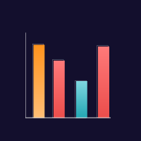
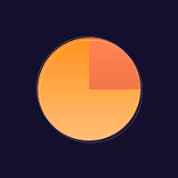
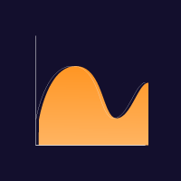
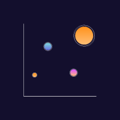
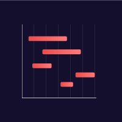

<span align='center'>
    
    <h2>GraphKit ( WIP )</h2>
</span>
<p align='center'>Graphing library for SwiftUI</p>
<br />

<span align='center'>
<h2>Now Seeking Contributors</h2>
</span>

The eventual goal here is to slowly over time offer similar functionality to D3.js but in a Swift package that can be installed easily via the Swift Package Manager

**If you'd like to follow the development of this project, we have a public feature board [here](https://trello.com/b/1b60nVkE).**

**Upcoming features for v1.0.0**
- Per-data-point labels
- Bar and Line graph state animations and detail views

### Graph Types

#### Bar Graphs


A simple line graph can be created using `BarGraph(data : [Double])` or optionally with a `BarGraphStyle` struct that contains settings for stroke widths, fill colors / gradients, and a few other options. More on this later.
****

#### Pie Graphs


A simple pie graph can be created using `PieGraph(data : [Double])` or optionally with a `PieGraphStyle` struct that contains settings for stroke widths, fill colors / gradients, and a few other options. More on this later.
****
#### Line Graph


A simple line graph can be created using `LineGraph(data : [Double])` or optionally with a `LineGraphStyle` struct that contains settings for stroke widths, fill colors / gradients, and a few other options. More on this later.

****
#### Bubble Chart / Scatter Plot


A simple bubble / scatter chart can be created using `BubbleGraph(data: [Point])` or optionally with a `BubbleGraphStyle` struct that contains settings for stroke widths, fill colors / gradients, and a few other options. More on this later.
****
#### Gantt Chart


A simple gantt chart can be created using `GanttChart(data : [DateInterval])` or optionally with a `GanttChartStyle` struct that contains settings for stroke widths, fill colors / gradients, and a few other options. More on this later.

### Styling Options

For each of the graph types, there exists a GraphStyle with the ability to specify some further options on how you want the graph to be laid out. By initializing one of these structs with whichever properties you want to change, and passing said struct either into the `gridStyle` modifier function in the view, or directly into the `style` argument upon creation, you can have any number of alternative looks for your graph.

**Example:**
```
  PieChart(data: [10, 20, 30])
    .GraphStyle(PieChartStyle<Color, Color>(
      theme: Theme(fill: Color.red)
    ))

  PieChart(
    data: [10, 20, 30],
    PieChartStyle<Color, Color>(
      theme: Theme(fill: Color.red)
    )
  )
```
